# DIU22
Prácticas Diseño Interfaces de Usuario 2021-22 (Tema: Hostels) 

Grupo: DIU2.HichAaron.  Curso: 2021/22 
Updated: 13/03/2022

Proyecto: 

***Carlota Braun Concerts***

Descripción: 

Nuestro proyecto trata de una sub-marca del Carlota Braun Hostel que se centra en añadir valor a los espectáculos musicales. Con la aplicación será posible ver todo el repertorio de conciertos disponibles, conocer información sobre estos y los artistas, comprar entradas y reservar una mesa para cenar.

Logotipo: 

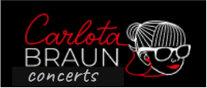

Miembros
 * :bust_in_silhouette:   Aarón Porcel Torres     :octocat:     
 * :bust_in_silhouette:  Hicham Bouchemma Bouhou     :octocat:

----- 

# Proceso de Diseño 

## Paso 1. UX Desk Research & Analisis 

 1.a Competitive Analysis
-----

Nos han asignado el Hostel Carlota Braun, el cual es un hostel muy céntrico de Granada, con espectaculos semanales y con habitaciones para grupos. Como competencia,
hemos buscado un hostel en Florencia, otra ciudad muy turística europea, y otro en pleno centro de Bilbao.
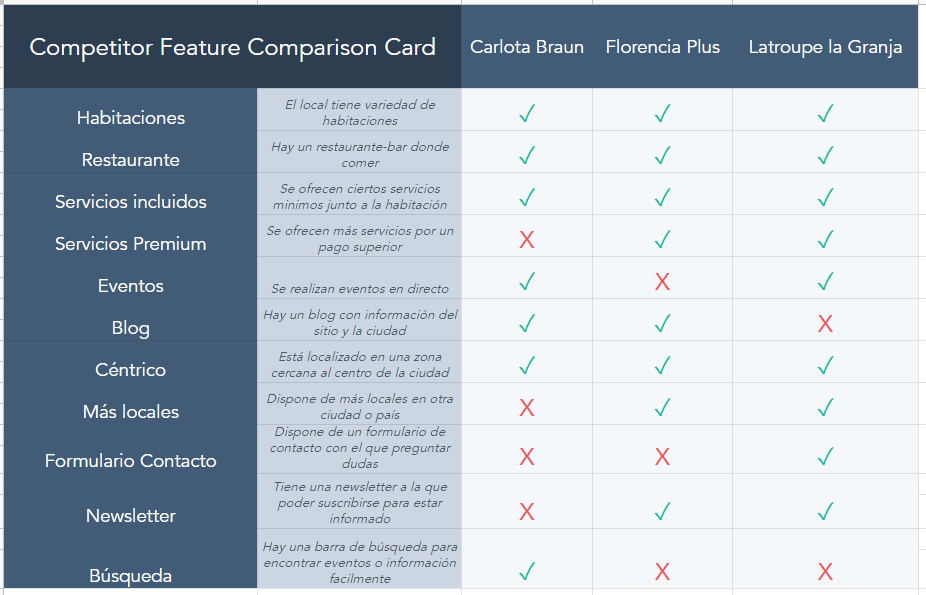

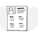 1.b Persona
-----

**Gonzalo Sanz Nieto:**
Hemos elegido a esta persona porque es un cliente potencial y tendría pocos problemas para conseguir alojarse en el hostel. Además es el alojamiento más adecuado para el tipo de viaje que suele realizar con sus amigos.

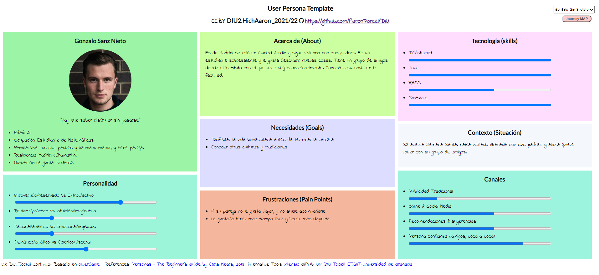

**Jennifer Wilson:**
Hemos elegido a esta persona porque es un cliente potencial, ya que suele viajar por el mundo y está acostumbrada. Es una mujer que adora hacer turismo. Nos ha parecido interesante ya que queríamos tener a alguien que adore viajar.

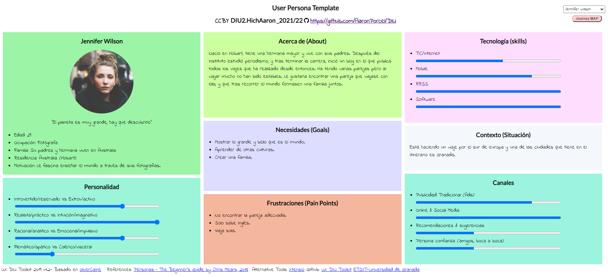

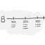 1.c User Journey Map
----

La primera experiencia que hemos escogido es la de un joven universitario que vive con sus padres y que se va de viaje con su grupo de amigos. Es una experiencia muy real, ya que es el público objetivo de los hostels.

La segunda experiencia que hemos escogido es la de una mujer extranjera que viaja por el mundo. Está acostumbrada a este tipo de sitios, pero se va a encontrar con que no puede reservar una sola cama, sino una habitación entera. Eso hará que la experiencia sea realista, ya que no es un hostel para todo tipo de clientes.

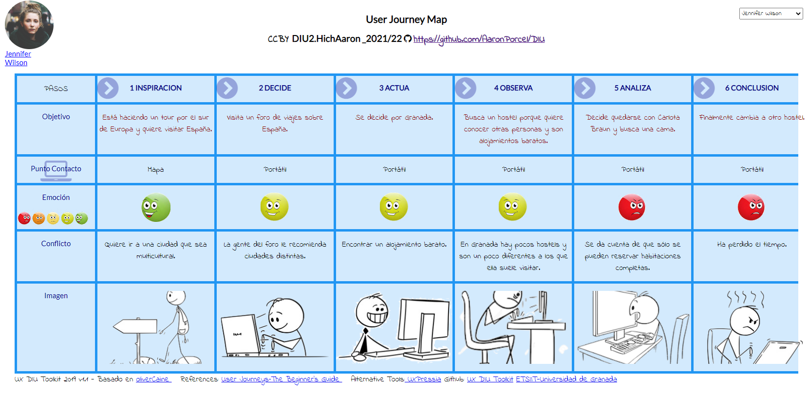

 1.d Usability Review
----

**Enlaces a las valoraciones de usabilidad (Usability Reviews):**  
[Carlota-Braun-Usability-review.pdf](https://github.com/AaronPorcel/DIU/blob/master/P1/Carlota-Braun-Usability-review.pdf)  
[Carlota-Braun-Usability-review.xlsx](https://github.com/AaronPorcel/DIU/blob/master/P1/Carlota-Braun-Usability-review.xlsx)
  
**Valoración final:** 66  
**Comentario sobre la valoración:**  
La página está bien diseñada pero no tiene una buena estructura y los tiempos de carga, aunque no son molestos, interrumpen la experiencia. La búsqueda es muy sencilla y solo sirve para los eventos, además no ofrece ninguna ayuda a los usuarios. 

## Paso 2. UX Design  

Nuestro proyecto se denomina Carlota Braun Concerts, una submarca del hostel que se encargará de añadir valor a los espectáculos musicales, convirtiéndolos en grandes conciertos con artistas famosos. Estos se realizan en el propio hostel y cualquier persona podrá acceder pagando una entrada. Sin embargo, los clientes del hostel tendrán entrada incluida en el alojamiento. Esto incrementará el número de clientes y ayudará a obtener beneficios en temporada baja de turistas.

 2.a Feedback Capture Grid / Empathy map / POV
----

**Empathy Map:**

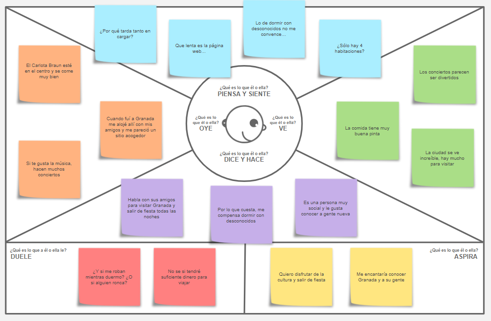

 2.b ScopeCanvas
----
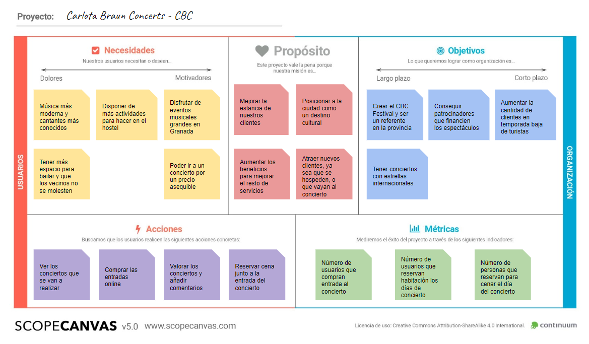 

 2.b Tasks analysis 
-----

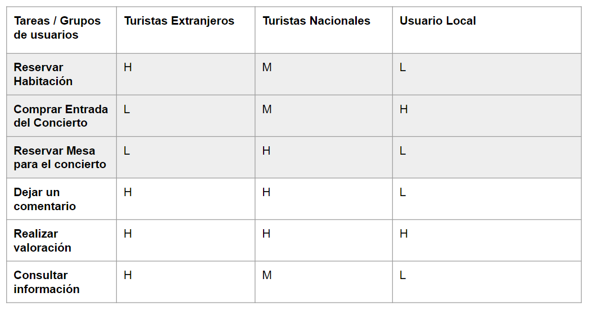 

 2.c IA: Sitemap + Labelling 
----

**Sitemap:**

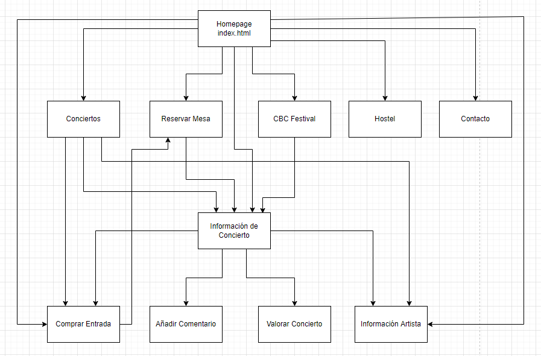 

**Labelling:**

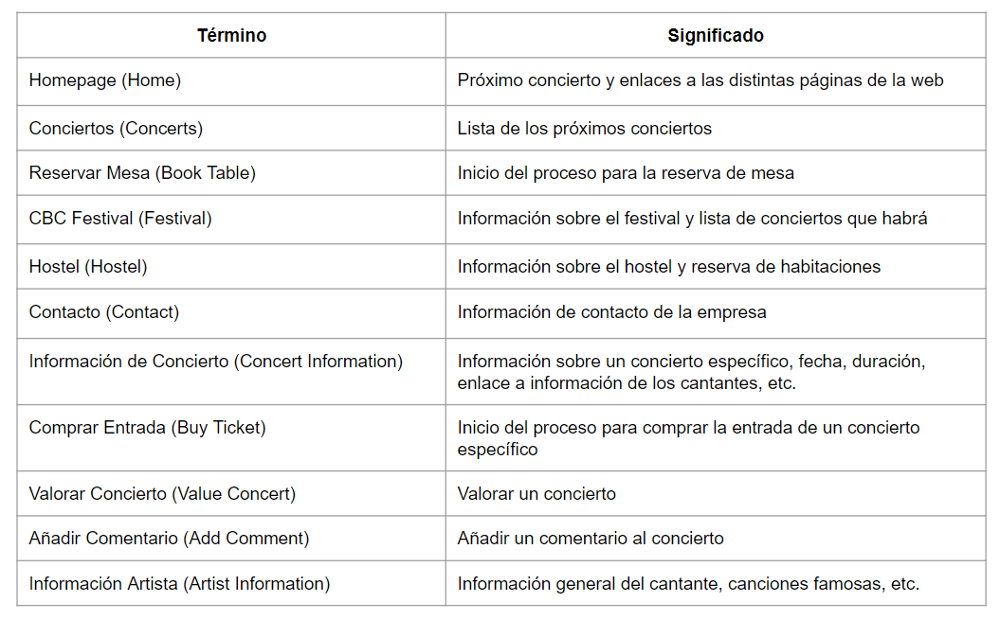 

 2.d Wireframes
-----

**Página Principal (index.html):**

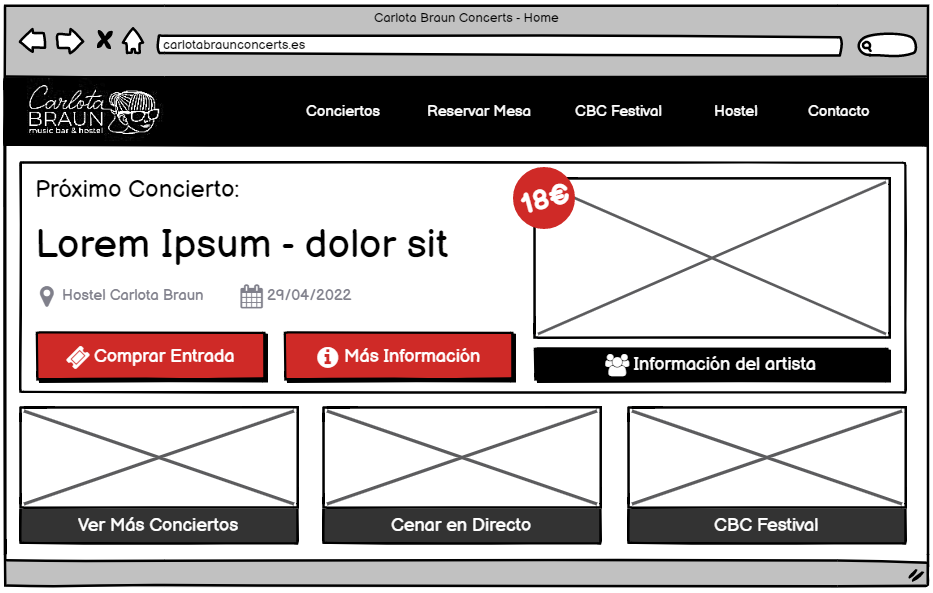 

**Información de Concierto (info.html):**

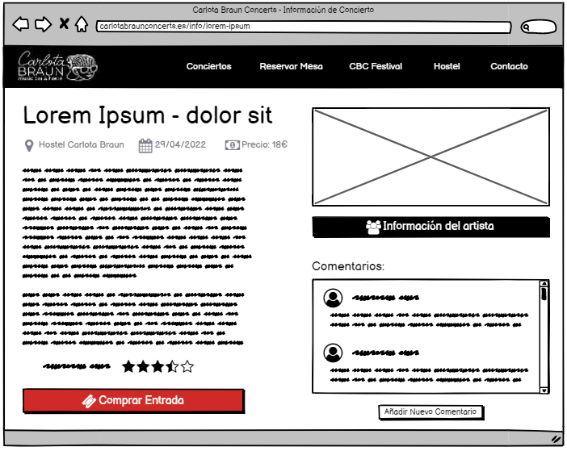 

**Comprar Entrada (buy.html):**

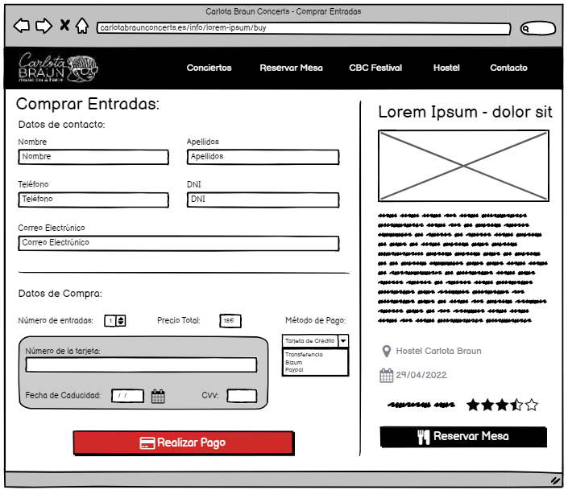 

## Paso 3. Mi UX-Case Study (diseño)

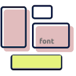 3.a Moodboard
-----

Inicialmente creamos un Moodboard para poder tener una idea general de nuestro diseño. En este incluimos unas imágenes inspiradoras, la tipografía y la paleta de colores que usaremos, y el logo de la página web.

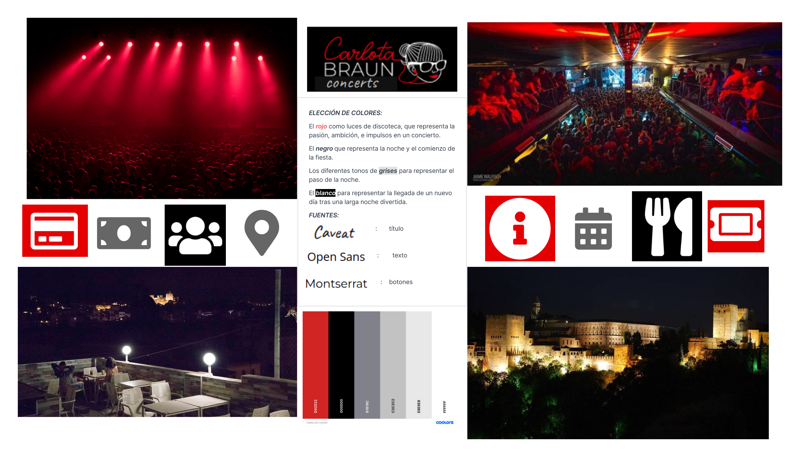

  3.b Landing Page
----

Diseñamos la landing page en la que esbozamos el objetivo del proyecto. En esta se mostrará:
- En la cabecera un logotipo reconocible y las principales funciones del proyecto.
- Como elemento principal se muestran los próximos conciertos junto con su información más relevante.
- Y finalmente se muestran enlaces directos a las secciones que más pueden interesar al usuario.

El diseño de la página es atractivo con colores que contrastan y mantienen la atención del cliente. La información y los elementos que pretendemos promocionar son fáciles de acceder mostrándose en la página principal. Es decir, el usuario no tiene que navegar por diferentes páginas para saber que es Carlota Braun Concerts y que ofrece.

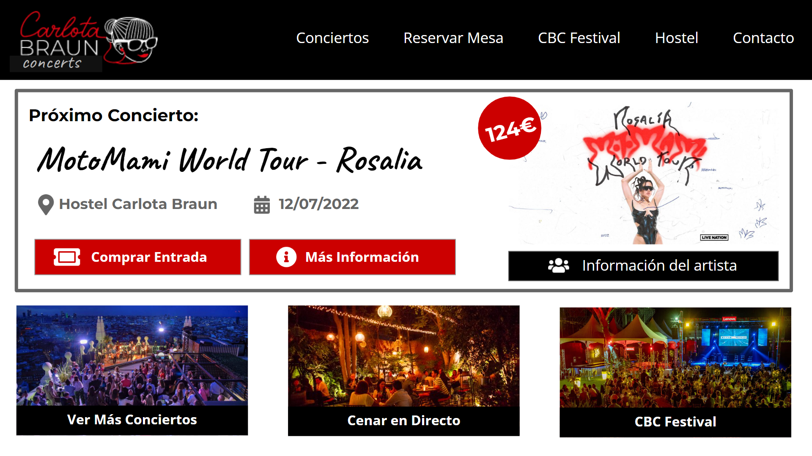 

 3.c Guidelines
----

En este apartado comentaremos el estilo visual de los componentes de la página web, así como el diseño de esta.

### Logotipo:

Para el logotipo nos hemos basado en el de la página principal para no perder la relación entre ambos sitios web. La diferencia que hay es que mientras en el logotipo original debajo de “Carlota Braun” y la imagen de la chica pone “music bar & hostel”, en el nuevo logotipo ponemos “concerts” con una tipografía diferente.

### Paleta de colores:

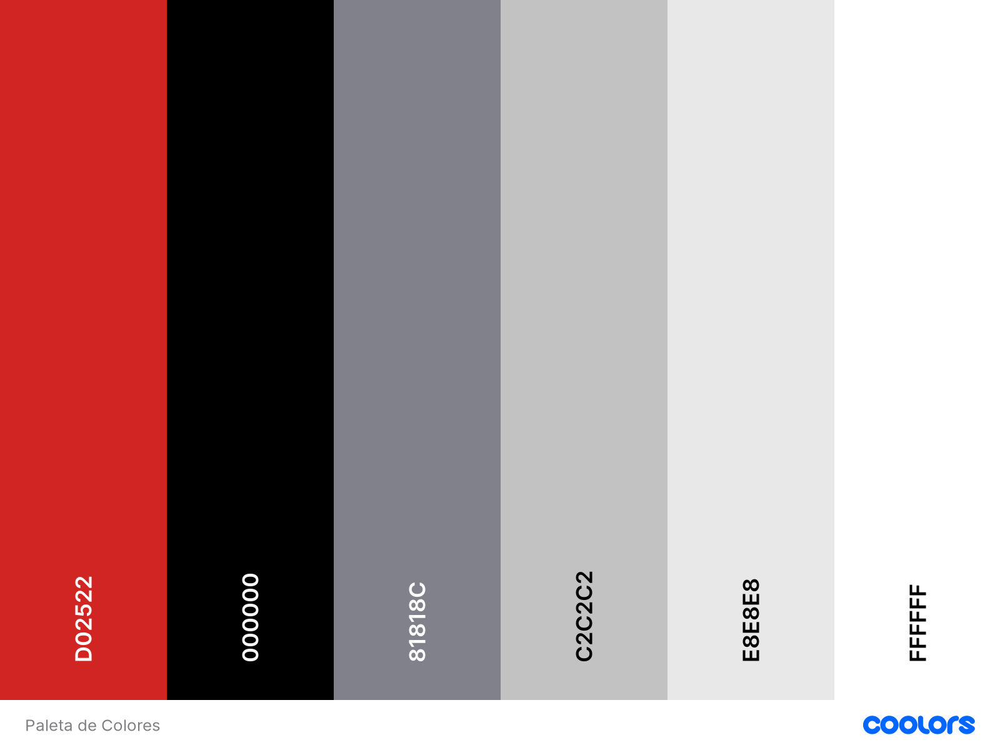

Para la paleta de colores se han escogido un conjunto de colores monocromáticos, que es el negro y la escala de grises, y otros dos colores complementarios entre sí y con el conjunto monocromático, que son el rojo y el blanco. En cuanto a rojo se usa para resaltar los elementos más importantes, por ejemplo los botones de compra y reserva. Es un color llamativo e impulsivo ideal para estos aspectos. El blanco se usa como fondo para transmitir limpieza, sencillez y calidad. Finalmente el negro y los diferentes tonos de grises se usan para el logotipo y las cabeceras.

### Tipografía:

Para facilitar la lectura y captar la atención de los usuarios hemos escogido las tres siguientes tipografías:

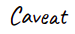

- Caveat para el título y el logotipo. Sus curvas y diseño aportan relajación y despreocupación, apropiada para nuestra temática.

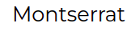

- Montserrat para el texto. Diseño ideal para el texto, simple y sencillo apropiado para la lectura.

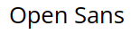

- Open Sans para los botones. También tiene un estilo simple y sencillo para transmitir seriedad y claridad a la hora de tomar decisiones (botones reserva, compra, etc).

### Patrones de diseño:

- En el **header** hemos incluido el logotipo y enlaces a los sitios más importantes. Este patrón es estático, es decir se mantiene en el resto de páginas.

- En la página principal debajo del body se presentan una serie de **cards** para ver el resto de conciertos, reservar mesa para cenar en directo e información con respecto al CBC Festival.  Este patrón no es estático, solamente se muestra en la página principal.

#### Patrones dinámicos:

- Body:

- **Body página principal**: En el body del sitio web incluiremos los próximos conciertos junto con otra información de interés relacionada con estos. Aparte se incluye un botón para iniciar el proceso de compra del concierto.

- **Body página del concierto**: Se muestra información y enlaces relacionados con el concierto, y un **sidebar** junto con los cantantes y enlaces a estos, y los comentarios. 

- **Body sitio de conciertos**: Una lista de todos los conciertos con un enlace para ir al sitio específico de cada uno.

- **Body sitio de compra**: Encontramos diferentes **inputs** de datos de contacto y compra que hay que rellenar y un **sidebar** con el concierto y un **botón** para reservar mesa.

- **Body información del artista o artistas**: Imagen del cantante o cantantes, una card en la que se incluye información de estos relacionada con su carrera musical y finalmente un botón que enlaza a los conciertos en los que va a actuar.

- **Body sitio de reserva de mesa**: **Checkbox** para seleccionar el concierto en el que se desea reservar mesa, y para seleccionar la mesa. Debajo de los checkbox, hay **inputs** de datos de contacto y compra que hay que rellenar junto con un **botón** para realizar el pago.

  3.d Mockup
----

### Home

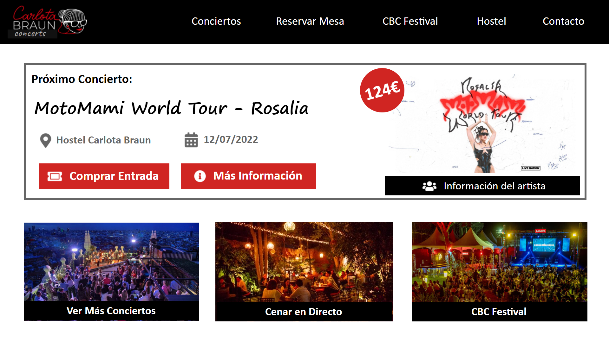 
   
---
  

### Comprar Entrada

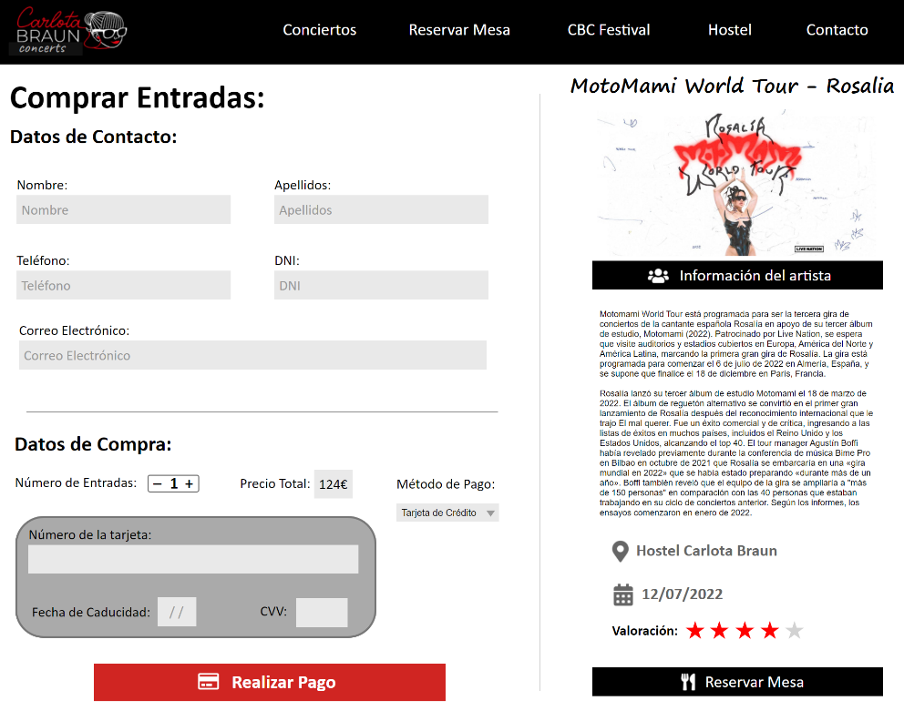 
   
---
  

### Información del Concierto

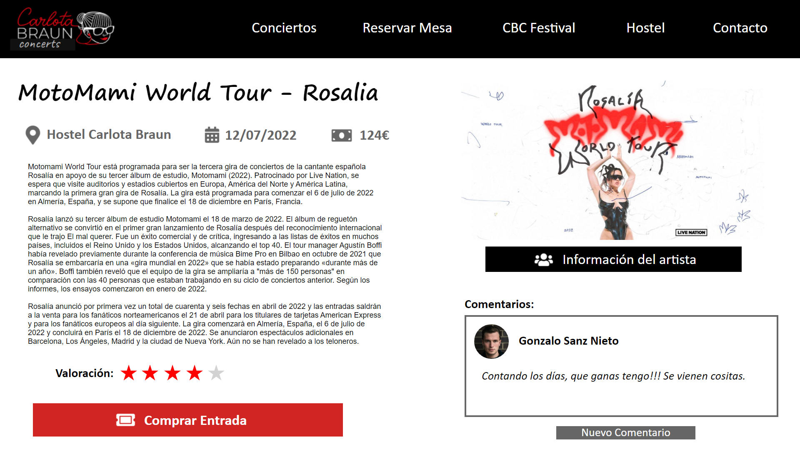 
   
---
  

### Información del Artista

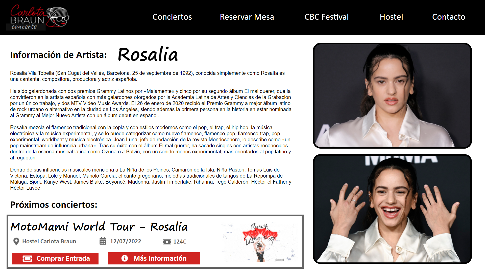 
   
---
  

### Conciertos

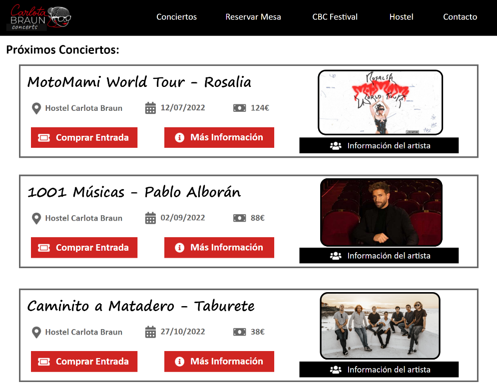 
   
---
  

### Reservar Mesa

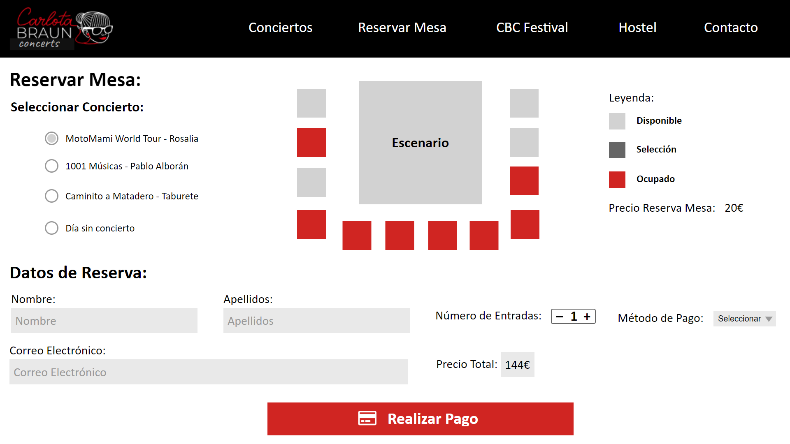 
   
---
  

### CBC Festival

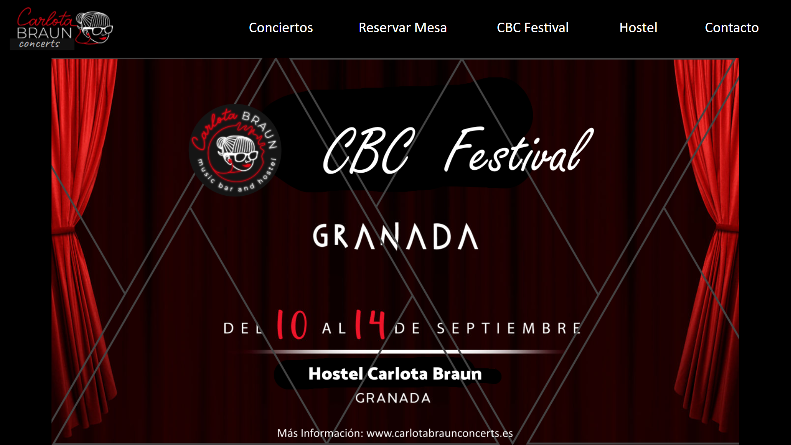 
   
---
  

### Simulación

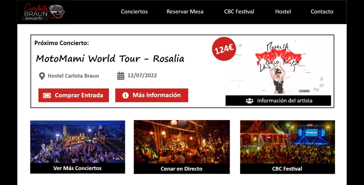 
   
---
  

 3.e ¿My UX-Case Study?
-----

Se publica nuestro Case Study en el archivo **readme.md** para que pueda ser estudiado por otras personas.

## Paso 4. Evaluación 

 4.a Caso asignado
----

[Planada](https://github.com/dacal01/DIU) es una aplicación la cual permite buscar  rutas turísticas por toda la provincia de Granada organizadas por un staff, permite organizar planes de ocio y ofrece un servicio de propuestas para que los clientes puedan proponer actividades a realizar durante su estancia.

Pero al usar la aplicación solo permite obtener una breve descripción de las posibles actividades que se pueden realizar. 

 4.b User Testing
----

| Usuarios  | Sexo/Edad | Ocupación   |  Exp.TIC    | Personalidad | Plataforma | TestA/B | Puntuación SUS |
| --------- | --------- | ----------- | ----------- | -----------  | ---------- | ------- | -------------- |
| Juan      | H / 73    | Jubilado    | Baja       | Disfruta con sus nietos y del tiempo libre pero se cabrea fácilmente | Movil Android       | B    |  92.5 |
| Tiana     | M / 20    | Estudiante  | Alta       | Es muy sociable y le encanta sorprenderse con nuevas amistades       | Web Escritorio Windows       | A  |  72.5 |
| Rosa      | M / 35    | Profesora de Yoga     | Media        | Es feliz sin estar en internet constantemente a internet y le gusta disfrutar de la naturaleza    | Móvil Android      | B  |  75 |
| Francisco | H / 52    | Empresario  | Alta       | Es poco flexible y le gusta que las cosas estén planificadas     |Web Escritorio Mac   | A  |  67.5 |

Hemos elegido estos personajes al azar tirando los tres dados (tipo, actividad y emoción) y los hemos completado con una personalidad:
- Juan (2,6,1): Es un abuelo jubilado que le gusta pasar tiempo con su familia, no tiene muchos conocimientos sobre nuevas tecnologías, por lo que cuanto más simple y claro sean los servicios que utiliza, menos cabreado y frustrado estará.
- Tiana (3,2,4): Es una estudiante erasmus de Traducción, tiene un perfil sociable, le encanta hacer nuevos amigos y maneja muy bien las tecnologías.
- Rosa (1,3,3): Es una profesora de yoga, le gusta la naturaleza, estar desconectada de internet, y usa aparatos tecnológicos solo en caso de necesidad.
- Francisco (4,4,5): Es un empresario, tiene poco tiempo libre y le gusta que las cosas salgan según lo planificado. Tiene un nivel alto de uso de tecnología.

. 4.c Cuestionario SUS
----

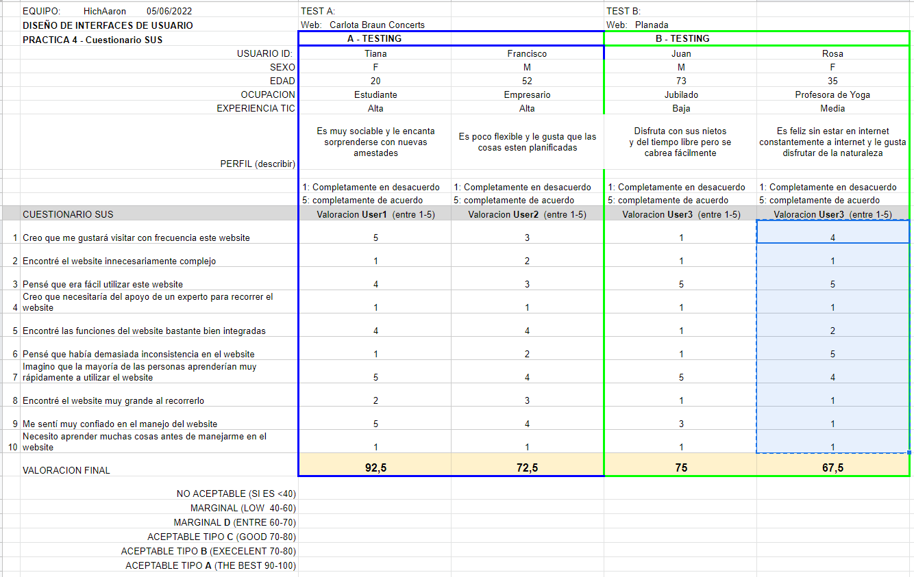

Tras realizar un System Usability Scale Test (SUS) con los usuarios, hemos llegado a las siguientes conclusiones: 
Los usuarios parecen preferir la aplicación de Carlota Braun por el mero hecho de que tiene varias funciones, y que es una aplicación muy sencilla de usar. 
Por el contrario, y aunque la aplicación de Planada también es sencilla de usar, no tiene ninguna función.

 4.d Usability Report
----

### Enlace
Enlace al Usability Report: [Usability Report](P4/DIU_report-template-usability-test_1.docx.pdf)

### Valoración personal
La aplicación no ofrece ninguna funcionalidad más allá de una descripción sobre las distintas actividades. No se puede consultar más información ni reservar actividades, tampoco podemos hacer login ni está adaptado para personas con discapacidad. Consideramos que con añadir unas mínimas funciones sería mucho más aceptada por los usuarios, pero con el estado actual, sólo añade más información.

## Conclusión final / Valoración de las prácticas

La realización de las prácticas de esta asignatura y en general haberla cursado nos ha enseñado que el dicho “lo que importa es el interior” no siempre es verdad. A veces centrarse tanto en el funcionamiento interno puede resultar en una interfaz deteriorada, inmanejable y poco comprensible que hace que sea tedioso el uso de una aplicación. 

Hemos aprendido los puntos esenciales  para realizar un correcto diseño de una interfaz. Como el tener una vista objetiva a la hora del diseño, atendiendo a diferentes grupos de usuarios totalmente distinto y siendo más autocríticos; y sobre todo considerar que una interfaz es el primer utensilio con el que se encuentra un usuario a interactuar con un sistema, o mejor dicho es la herramienta que nos permite usar el sistema, y por lo tanto debe ser adecuada y la experiencia al interactuar con esta debe ser agradable para que el usuario vuelva a usarla.

Otras tareas nos han enseñado que los pequeños detalles son los que marcan la diferencia, como por ejemplo la simple combinación de colores, el uso de widgets adecuados, el orden y los espacios, etc. Son puntos que a primera vista no son importantes pero  hacen que un usuario diga “me gusta esta app, pero no sé por qué”. 

Concluimos diciendo que nos sentimos satisfechos con los resultados obtenidos y nos marchamos con la sensación de que claramente podemos usar lo aprendido en nuestro futuro profesional. 

