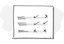
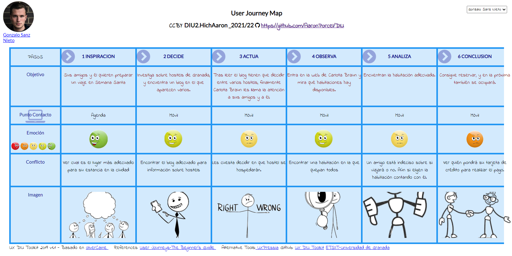
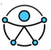

# DIU22
Prácticas Diseño Interfaces de Usuario 2021-22 (Tema: Hostels) 

Grupo: DIU2.HichAaron.  Curso: 2021/22 
Updated: 13/03/2022

Proyecto: 
>>> Decida el nombre corto de su propuesta en la práctica 2 

Descripción: 

>>> Describa la idea de su producto en la práctica 2 

Logotipo: 
>>> Opcionalmente si diseña un logotipo para su producto en la práctica 3 pongalo aqui

Miembros
 * :bust_in_silhouette:   Aarón Porcel Torres     :octocat:     
 * :bust_in_silhouette:  Hicham Bouchemma Bouhou     :octocat:

----- 

# Proceso de Diseño 

## Paso 1. UX Desk Research & Analisis 

 1.a Competitive Analysis
-----

Nos han asignado el Hostel Carlota Braun, el cual es un hostel muy céntrico de Granada, con espectaculos semanales y con habitaciones para grupos. Como competencia,
hemos buscado un hostel en Florencia, otra ciudad muy turística europea, y otro en pleno centro de Bilbao.

 1.b Persona
-----

**Gonzalo Sanz Nieto:**
Hemos elegido a esta persona porque es un cliente potencial y tendría pocos problemas para conseguir alojarse en el hostel. Además es el alojamiento más adecuado para el tipo de viaje que suele realizar con sus amigos.

**Jennifer Wilson:**
Hemos elegido a esta persona porque es un cliente potencial, ya que suele viajar por el mundo y está acostumbrada. Es una mujer que adora hacer turismo. Nos ha parecido interesante ya que queríamos tener a alguien que adore viajar.

 1.c User Journey Map
----

La primera experiencia que hemos escogido es la de un joven universitario que vive con sus padres y que se va de viaje con su grupo de amigos. Es una experiencia muy real, ya que es el público objetivo de los hostels.

La segunda experiencia que hemos escogido es la de una mujer extranjera que viaja por el mundo. Está acostumbrada a este tipo de sitios, pero se va a encontrar con que no puede reservar una sola cama, sino una habitación entera. Eso hará que la experiencia sea realista, ya que no es un hostel para todo tipo de clientes.

 1.d Usability Review
----

**Enlaces a las valoraciones de usabilidad (Usability Reviews):**  
[Carlota-Braun-Usability-review.pdf](https://github.com/AaronPorcel/DIU/blob/master/P1/Carlota-Braun-Usability-review.pdf)  
[Carlota-Braun-Usability-review.xlsx](https://github.com/AaronPorcel/DIU/blob/master/P1/Carlota-Braun-Usability-review.xlsx)
  
**Valoración final:** 66  
**Comentario sobre la valoración:**  
La página está bien diseñada pero no tiene una buena estructura y los tiempos de carga, aunque no son molestos, interrumpen la experiencia. La búsqueda es muy sencilla y solo sirve para los eventos, además no ofrece ninguna ayuda a los usuarios. 

## Paso 2. UX Design  

Nuestro proyecto se denomina Carlota Braun Concerts, una submarca del hostel que se encargará de añadir valor a los espectáculos musicales, convirtiéndolos en grandes conciertos con artistas famosos. Estos se realizan en el propio hostel y cualquier persona podrá acceder pagando una entrada. Sin embargo, los clientes del hostel tendrán entrada incluida en el alojamiento. Esto incrementará el número de clientes y ayudará a obtener beneficios en temporada baja de turistas.

 2.a Feedback Capture Grid / Empathy map / POV
----

**Empathy Map:**

 2.b ScopeCanvas
----
 

 2.b Tasks analysis 
-----

 

 2.c IA: Sitemap + Labelling 
----

**Sitemap:**

 

**Labelling:**

 

 2.d Wireframes
-----

**Página Principal (index.html):**

 

**Información de Concierto (info.html):**

 

**Comprar Entrada (buy.html):**

 

## Paso 3. Mi UX-Case Study (diseño)

 3.a Moodboard
-----

Inicialmente creamos un Moodboard para poder tener una idea general de nuestro diseño. En este incluimos unas imágenes inspiradoras, la tipografía y la paleta de colores que usaremos, y el logo de la página web.

  3.b Landing Page
----

Diseñamos la landing page en la que esbozamos el objetivo del proyecto. En esta se mostrará:
- En la cabecera un logotipo reconocible y las principales funciones del proyecto.
- Como elemento principal se muestran los próximos conciertos junto con su información más relevante.
- Y finalmente se muestran enlaces directos a las secciones que más pueden interesar al usuario.

El diseño de la página es atractivo con colores que contrastan y mantienen la atención del cliente. La información y los elementos que pretendemos promocionar son fáciles de acceder mostrándose en la página principal. Es decir, el usuario no tiene que navegar por diferentes páginas para saber que es Carlota Braun Concerts y que ofrece.

 

 3.c Guidelines
----

>>> Estudio de Guidelines y Patrones IU a usar 
>>> Tras documentarse, muestre las deciones tomadas sobre Patrones IU a usar para la fase siguiente de prototipado. 

  3.d Mockup
----

**Home**

 

**Comprar Entrada**

 

**Información del Concierto**

 

**Información del Artista**

 

**Conciertos**

 

**Reservar Mesa**

 

**CBC Festival**

 

**Simulación**

 

 3.e ¿My UX-Case Study?
-----

>>> Publicar my Case Study en Github..
>>> Documente y resuma el diseño de su producto en forma de video de 90 segundos aprox

## Paso 4. Evaluación 

 4.a Caso asignado
----

>>> Breve descripción del caso asignado con enlace a  su repositorio Github

 4.b User Testing
----

>>> Seleccione 4 personas ficticias. Exprese las ideas de posibles situaciones conflictivas de esa persona en las propuestas evaluadas. Asigne dos a Caso A y 2 al caso B
 

| Usuarios | Sexo/Edad     | Ocupación   |  Exp.TIC    | Personalidad | Plataforma | TestA/B
| ------------- | -------- | ----------- | ----------- | -----------  | ---------- | ----
| User1's name  | H / 18   | Estudiante  | Media       | Introvertido | Web.       | A 
| User2's name  | H / 18   | Estudiante  | Media       | Timido       | Web        | A 
| User3's name  | M / 35   | Abogado     | Baja        | Emocional    | móvil      | B 
| User4's name  | H / 18   | Estudiante  | Media       | Racional     | Web        | B 

. 4.c Cuestionario SUS
----

>>> Usaremos el **Cuestionario SUS** para valorar la satisfacción de cada usuario con el diseño (A/B) realizado. Para ello usamos la [hoja de cálculo](https://github.com/mgea/DIU19/blob/master/Cuestionario%20SUS%20DIU.xlsx) para calcular resultados sigiendo las pautas para usar la escala SUS e interpretar los resultados
http://usabilitygeek.com/how-to-use-the-system-usability-scale-sus-to-evaluate-the-usability-of-your-website/)
Para más información, consultar aquí sobre la [metodología SUS](https://cui.unige.ch/isi/icle-wiki/_media/ipm:test-suschapt.pdf)

>>> Adjuntar captura de imagen con los resultados + Valoración personal 

 4.d Usability Report
----

>> Añadir report de usabilidad para práctica B (la de los compañeros)

>>> Valoración personal 

>>> ## Paso 5. Evaluación de Accesibilidad  (no necesaria)

>>>   5.a Accesibility evaluation Report 
>>>> ----

>>> Indica qué pretendes evaluar (de accesibilidad) sobre qué APP y qué resultados has obtenido 

>>> 5.a) Evaluación de la Accesibilidad (con simuladores o verificación de WACG) 
>>> 5.b) Uso de simuladores de accesibilidad 

>>> (uso de tabla de datos, indicar herramientas usadas) 

>>> 5.c Breve resumen del estudio de accesibilidad (de práctica 1) y puntos fuertes y de mejora de los criterios de accesibilidad de tu diseño propuesto en Práctica 4.

## Conclusión final / Valoración de las prácticas

>>> (90-150 palabras) Opinión del proceso de desarrollo de diseño siguiendo metodología UX y valoración (positiva /negativa) de los resultados obtenidos  

